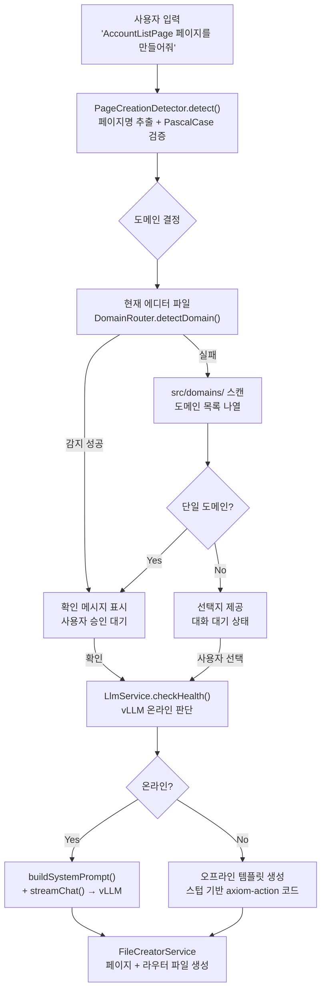

# Page Creation Interactive Flow 구현 계획

## 현재 상태 파악

### 이미 갖춰진 것
- `knowledge/conventions/naming.md` — PascalCase + Page 규칙 RAG 이미 존재
- `knowledge/patterns/page-generation.md` — 도메인 시나리오 A/B, axiom-action 형식 완전 정의
- `ScaffoldContextBuilder._getDomainContext()` — 도메인 존재 여부 체크 + 라우터 주입
- `LlmService.streamChat()` — 네트워크 오류 시 자동 FallbackStubService 폴백
- `SpecWizardState` / wizard 패턴 — 대화형 상태 머신 패턴 레퍼런스로 활용 가능

### 부족한 것
- 페이지 생성 **인텐트 감지** — "AccountListPage 만들어줘" 패턴 미인식
- **도메인 불명확 시 대화형 해결** — 현재 `_extractDomainFromQuery`는 "account 업무/도메인" 패턴만 지원
- **사전 LLM 헬스체크** — 오프라인 판단 후 적절한 분기 없음
- **페이지 생성 전용 오프라인 스텁** — `.stubs/create-page.md` 없음

---

## 전체 플로우 다이어그램



---

## 구현 대상 파일

### 1. `src/ai/PageCreationDetector.ts` (신규)
페이지 생성 인텐트를 감지하고 페이지명을 추출한다.

```typescript
export interface PageCreationIntent {
  isPageCreation: boolean;
  pageName: string | null;   // PascalCase + Page 정규화
  rawName: string | null;    // 원본 입력
}
```

인식 패턴:
- `"AccountListPage 페이지를 만들어줘"` → pageName: `"AccountListPage"`
- `"AccountList 페이지 만들어줘"` → pageName: `"AccountListPage"` (Page 접미사 자동 추가)
- `"account-list 페이지 생성해줘"` → pageName: `"AccountListPage"` (kebab-case 변환)
- `"계좌 목록 페이지 만들어줘"` → 페이지 생성은 감지하되 pageName은 null (LLM에 위임)

### 2. `src/ai/LlmService.ts` (수정)
`checkHealth()` 메서드 추가. 2초 타임아웃으로 `/v1/models` GET 요청.

```typescript
async checkHealth(config: LlmConfig): Promise<boolean>
```

### 3. `src/providers/ChatViewProvider.ts` (수정)
`_handleMessage()`에 페이지 생성 분기 추가.

상태 필드 추가:
```typescript
private _pendingPageCreation: {
  pageName: string;
  domainCandidates: string[];
  waitingForSelection: boolean;
} | null = null;
```

처리 순서:
1. `PageCreationDetector.detect(text)` 호출
2. 도메인 결정 시도:
   - 현재 에디터 경로 → `DomainRouter.detectDomain()`
   - 실패 시 `src/domains/` 스캔
3. 도메인 확정/선택 후 `checkHealth()` 호출
4. 온라인/오프라인 분기 처리

### 4. `src/types/messages.ts` (수정)
`PageCreationState` 타입을 `SpecWizardState`와 동일한 패턴으로 추가.

### 5. `.stubs/create-page.md` (신규)
오프라인 시 페이지 생성 전용 스텁. keywords 매칭 + 완전한 axiom-action 블록 포함.

```markdown
---
keywords: [페이지 만들어줘, 페이지 생성, page create, 만들어줘]
---
(기본 페이지 코드 + axiom-action 블록)
```

### 6. `src/ai/ScaffoldContextBuilder.ts` (수정)
`_extractDomainFromQuery()` 확장 — 페이지명 접두어에서 도메인 추출 지원.

예: `"AccountListPage"` → PascalCase 첫 단어 `"Account"` → kebab-case 변환 → `"account"`

---

## 구현 상세 — 도메인 결정 로직 (`ChatViewProvider`)

```
1. 현재 활성 에디터 파일 경로로 DomainRouter.detectDomain() 시도
2. 실패 시 → ws/src/domains/ 폴더 목록 스캔
3. 도메인 0개 → "도메인 폴더를 찾을 수 없습니다. 도메인명을 직접 입력해주세요."
4. 도메인 1개 → "{domain} 도메인에 생성하겠습니다. 맞으면 '네', 다르면 도메인명을 입력해주세요."
5. 도메인 2개 이상 → 번호 목록 제공, 입력 대기
   예: "1. account  2. main  3. order  (번호 또는 도메인명 입력)"
6. 사용자 응답이 들어오면 → _pendingPageCreation에서 선택된 도메인으로 확정 → 생성 진행
```

---

## 오프라인 처리 상세

- `LlmService.checkHealth()` 타임아웃 또는 실패 → 오프라인 판단
- 오프라인 시: `FallbackStubService` 대신 전용 **템플릿 생성** 경로를 탄다
- pageName + domain이 확정되었으므로 axiom-action 블록을 직접 조합하여 `FileCreatorService`에 전달
- `_buildOfflinePageActions(pageName, domain)` 헬퍼 메서드 추가 (ChatViewProvider 또는 별도 파일)
- 도메인 존재 여부에 따라 시나리오 A(2개 액션) / B(3개 액션) 분기
